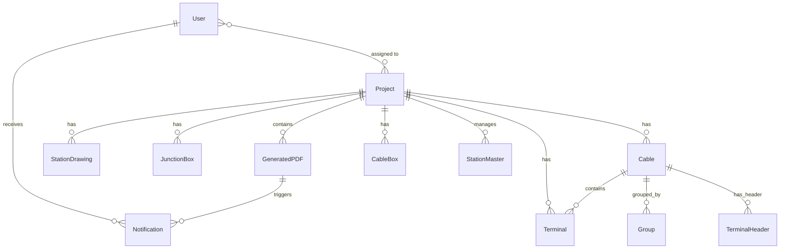
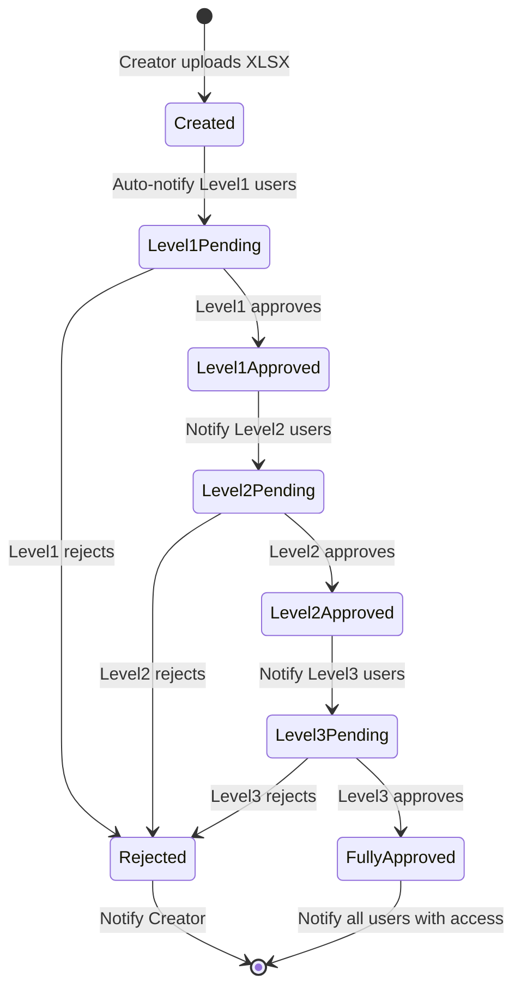

# DrawingMaster Architecture Documentation

## System Architecture Overview

```
┌─────────────────────────────────────────────────────────────────┐
│                          User Layer                             │
│  ┌──────────┐  ┌──────────┐  ┌──────────┐  ┌──────────┐       │
│  │  Viewer  │  │ Creator  │  │Approver L2│  │Approver L3│       │
│  │ (Role 0) │  │ (Role 1) │  │  (Role 2) │  │  (Role 3) │       │
│  └──────────┘  └──────────┘  └──────────┘  └──────────┘       │
│                       ┌──────────┐                              │
│                       │  Admin   │                              │
│                       │ (Role 4) │                              │
│                       └──────────┘                              │
└────────────────────────┬────────────────────────────────────────┘
                         │
                         ▼
┌─────────────────────────────────────────────────────────────────┐
│                     Flask Web Application                       │
│  ┌──────────────────────────────────────────────────────────┐  │
│  │               Routes Layer (routes.py)                    │  │
│  │  • Authentication  • Project Management  • PDF Upload     │  │
│  │  • Approvals      • User Management      • Notifications  │  │
│  └──────────────────────────────────────────────────────────┘  │
│  ┌──────────────────────────────────────────────────────────┐  │
│  │            Business Logic Layer (models.py)               │  │
│  │  • User Management  • Project Lifecycle  • Approvals      │  │
│  │  • Version Control  • Checksum Generation                 │  │
│  └──────────────────────────────────────────────────────────┘  │
│  ┌──────────────────────────────────────────────────────────┐  │
│  │             Session Management (Flask-Session)            │  │
│  │  • PostgreSQL-backed sessions  • Auto-timeout (30 min)    │  │
│  └──────────────────────────────────────────────────────────┘  │
└────────────────────────┬────────────────────────────────────────┘
                         │
                         ▼
┌─────────────────────────────────────────────────────────────────┐
│                    PostgreSQL Database                          │
│  ┌─────────────┐  ┌──────────────┐  ┌──────────────┐          │
│  │    users    │  │   projects   │  │ generated_pdf│          │
│  │  sessions   │  │station_drawing│ │notifications │          │
│  │junction_box │  │    cable     │  │  cable_box   │          │
│  │  terminal   │  │    group     │  │terminal_header│          │
│  │ choketable  │  │resistortable │  │station_master│          │
│  └─────────────┘  └──────────────┘  └──────────────┘          │
└────────────────────────┬────────────────────────────────────────┘
                         │
    ┌────────────────────┼────────────────────┐
    │                    │                    │
    ▼                    ▼                    ▼
┌─────────┐     ┌────────────────┐    ┌──────────────┐
│  FTP/   │     │  PDF Generator │    │ File Storage │
│  SFTP   │────▶│  (Matplotlib)  │───▶│   uploads/   │
│ Monitor │     │excel_to_pdf... │    │  temp_pdf/   │
└─────────┘     └────────────────┘    └──────────────┘
```

## Component Details

### 1. Flask Application Core (`Circuitbuilding/app/`)

#### __init__.py - Application Factory
- Creates and configures Flask app
- Database initialization
- Session management setup
- LoginManager configuration
- IST timezone handling
- Before-request hooks for session timeout

#### models.py - Data Layer (880 lines)
- **14 SQLAlchemy Models**:
  - User (authentication, roles, permissions)
  - Project (project lifecycle, status, junction data)
  - StationDrawing (station metadata)
  - GeneratedPDF (PDF metadata, checksums, approval status)
  - JunctionBox, Cable, CableBox, Terminal
  - Group, TerminalHeader
  - ChokeTable, ResistorTable
  - Notification (approval notifications)
  - StationMaster (station access control)

#### routes.py - API Layer (523KB, extensive)
- Authentication routes
- Project CRUD operations
- Excel upload and parsing
- PDF generation triggers
- Approval workflow handlers
- User management (admin)
- Notification API
- File serving

#### schemas.py - Data Schemas
- Excel sheet column definitions
- Validation rules
- Header hints for UI

### 2. PDF Generation Engine (`excel_to_pdf_converter.py`)

**3915 lines of circuit diagram generation logic**

#### Core Functions:
```python
# Checksum & Metadata
generate_pdf_metadata_checksum()      # MD5 checksum generation
enhance_pdf_with_metadata()           # Embed metadata in PDF
update_pdf_checksum_metadata()        # Update PDF metadata

# Row Management
get_row_order()                       # F-E-D-C-B-A ordering
break_cables_into_rows_updated()      # Pagination (36 terminals/row)

# Drawing Components
draw_cable_box_row()                  # Cable box rendering
draw_extra_connections()              # Staggered connection layers
draw_cable_name()                     # Cable labels with circles
draw_junction_box()                   # Junction box rectangles

# Symbol Drawing
draw_relay_input/output()             # Relay symbols
draw_group_top/bottom_symbol()        # Terminal grouping symbols
draw_fuse()                           # Fuse symbols
draw_dual_fuse()                      # Dual fuse symbols
draw_resistor()                       # Resistor symbols
draw_choke()                          # Choke symbols
draw_terminal()                       # Terminal connections

# Bus & Connections
draw_horizontal_bus()                 # Input/output bus lines
draw_connections()                    # Terminal connections
merge_ranges()                        # Connection range merging
```

#### Rendering Pipeline:
1. Parse Excel sheets (Pandas)
2. Extract station metadata
3. Sort rows (F → A descending)
4. Break into pages (36 terminals max/row)
5. Calculate positions
6. Draw symbols (Matplotlib patches)
7. Draw connections (lines, staggered layers)
8. Add terminal numbers
9. Generate PDF (PdfPages)
10. Embed metadata & checksum

### 3. FTP Automation Daemon (`ftp_auto_converter.py`)

**1492 lines of file monitoring and processing**

#### Architecture:
```python
# Connection Management
get_sftp_connection()                 # Paramiko SFTP
get_ftp_connection()                  # ftplib FTP

# File Operations
list_remote_files()                   # List FTP directory
download_file_remote()                # SFTP/FTP download
upload_file_remote()                  # Upload with verification
move_file_remote()                    # Move processed files
delete_file_remote()                  # Delete files

# Processing Pipeline
get_project_id_from_filename()        # Extract project ID
extract_xlsx_metadata()               # Parse StationDrawing sheet
get_next_version()                    # Auto-increment versions
update_database_with_models()         # SQLAlchemy updates

# Workflow
setup_local_directories()             # Create temp dirs
load_processed_files()                # Load cache
discover_remote_paths()               # Debug FTP structure
monitor_and_process()                 # Main loop (30s interval)
```

#### Processing Flow:
```
1. Monitor FTP directory (30s interval)
   ↓
2. Find new XLSX files (RAILWAYPROJECT_ID{n}_*.xlsx)
   ↓
3. Check if already processed (cache)
   ↓
4. Download to downloaded_xlsx_files/
   ↓
5. Extract project ID from filename
   ↓
6. Verify project exists & status = 'ready_for_pdf'
   ↓
7. Parse Excel metadata
   ↓
8. Run excel_to_pdf_converter.py subprocess
   ↓
9. Parse converter output for checksums
   ↓
10. Copy XLSX & PDF to uploads/
   ↓
11. Upload both to remote uploads/
   ↓
12. Update database:
    - Create GeneratedPDF record
    - Update/Create StationDrawing
    - Increment version
    - Create Level 1 notifications
   ↓
13. Move remote XLSX to processed/
   ↓
14. Update project status & stage
   ↓
15. Log to processed_files.log
```

### 4. Database Schema

#### Relationships



#### Key Tables

**users**
- id, username, email, password_hash
- role (0-4), designation (level1/2/3)
- mobile_number, is_active
- created_at

**railway_projects**
- id, name, description
- status, stage, junction_data
- created_at, updated_at

**generated_pdf**
- id, project_id, pdf_filename, xlsx_filename
- checksum_md5, metadata_checksum, full_file_md5
- version, file_size
- level1/2/3_status
- created_at

**station_drawing**
- id, project_id, station_code, station_name
- version, checksum
- zone, division, diagram_name
- drawn_by, checked_by
- designation1/2/3

**notifications**
- id, user_id, pdf_id, project_id
- level (level1/2/3/final)
- status (pending/approved/rejected)
- message, is_read

## Approval Workflow State Machine



## Security Architecture

### Authentication Flow
1. User submits credentials
2. routes.py validates against User.password_hash
3. Flask-Login creates session
4. Session stored in PostgreSQL sessions table
5. Session ID cookie sent to browser (httponly, samesite=Lax)

### Authorization
- **Role-based**: 0 (Viewer), 1 (Creator), 2/3 (Approvers), 4 (Admin)
- **Permission checks**: `@login_required`, custom decorators
- **Project access**: `check_user_project_access()` in test1.py
- **Station access**: StationMaster table for granular permissions

### Session Security
- 30-minute auto-timeout
- Activity tracking (`last_activity` in session)
- IST timezone for consistency
- PostgreSQL-backed (survives restarts)
- Automatic cleanup on timeout

### File Security
- Upload validation (file extensions)
- Checksum verification (MD5)
- Metadata embedding in PDFs
- FTP/SFTP encrypted transfers

## Scalability Considerations

### Current Design
- Single-server Flask app
- PostgreSQL database (production: remote)
- File storage on local disk
- FTP daemon runs as separate process

### Bottlenecks
1. **PDF generation**: CPU-intensive Matplotlib rendering
2. **File storage**: Local disk for uploads/temp
3. **FTP monitoring**: Single-threaded daemon

### Scaling Options
1. **Horizontal**: Deploy multiple Flask instances with load balancer
2. **Background jobs**: Move PDF generation to Celery/RQ workers
3. **File storage**: Migrate to S3/MinIO/shared NFS
4. **Caching**: Add Redis for session/query caching
5. **Database**: Read replicas for heavy queries

## Deployment Architecture

### Development
```
localhost:5000
├── Flask dev server
├── SQLite/PostgreSQL (local)
└── Local file storage
```

### Production (Recommended)
```
User → Nginx (reverse proxy, SSL)
  ↓
  → Gunicorn (4 workers)
     ↓
     → Flask App
        ├── PostgreSQL (remote)
        ├── Redis (sessions, cache)
        └── NFS/S3 (file storage)

Separate Server:
  → FTP Daemon (ftp_auto_converter.py)
  → Celery Workers (PDF generation)
```

## Monitoring & Logging

### Current Logging
- `ftp_converter.log` - FTP automation events
- `processed_files.log` - Processed file cache
- `checksum.log` - PDF checksum records
- Flask logs (console in dev)

### Recommended Additions
- Application performance monitoring (New Relic, Datadog)
- Error tracking (Sentry)
- Structured logging (JSON format)
- Log aggregation (ELK stack)
- Database query analysis (pgBadger)

## Technology Justification

### Why Flask?
- Lightweight for medium-scale app
- Excellent extension ecosystem
- Easy to customize
- Python ecosystem for data processing

### Why PostgreSQL?
- ACID compliance for financial/approval data
- Lightweight for medium-scale app
- JSON support for junction_data
- Strong Python integration
- Session table storage
- Production-ready

### Why Matplotlib for PDFs?
- Programmatic drawing control
- Complex circuit diagrams
- Python integration
- Vector output (scalable PDFs)
- Extensive customization

### Why FTP/SFTP?
- Client requirement (existing infrastructure)
- Secure file transfer
- Automation-friendly
- Wide compatibility

---

**Architecture Last Updated**: 2026-01-06
